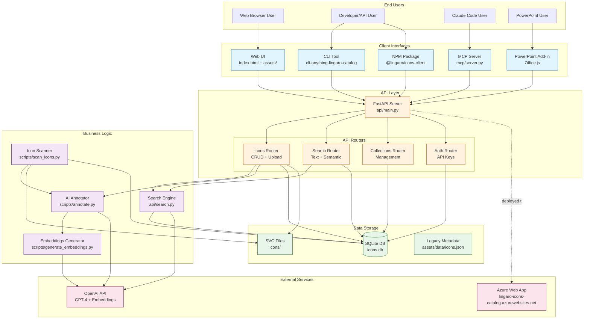
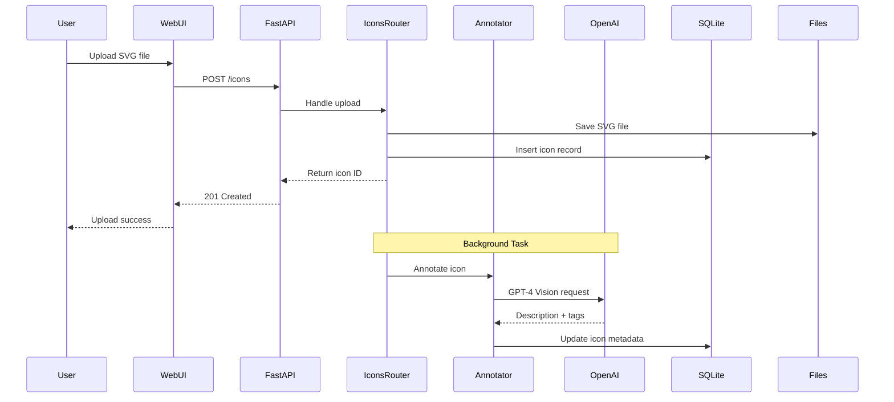
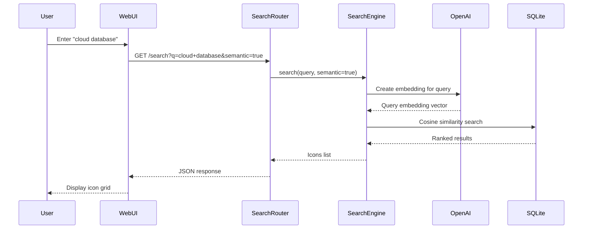
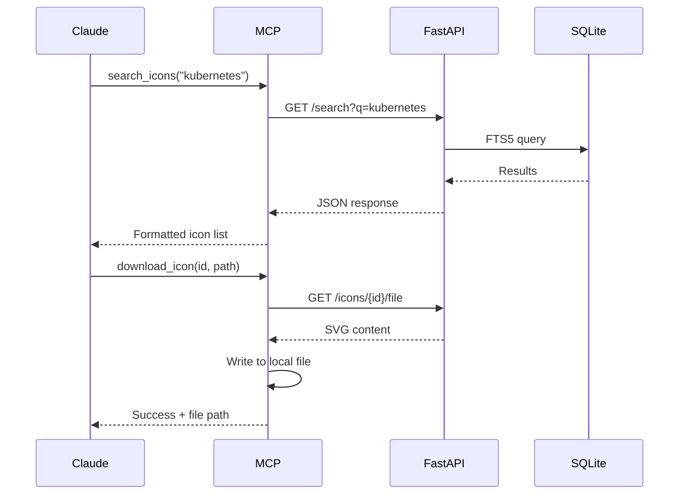
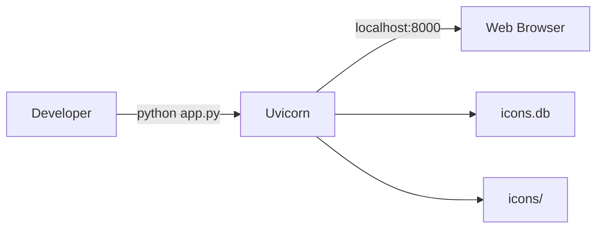
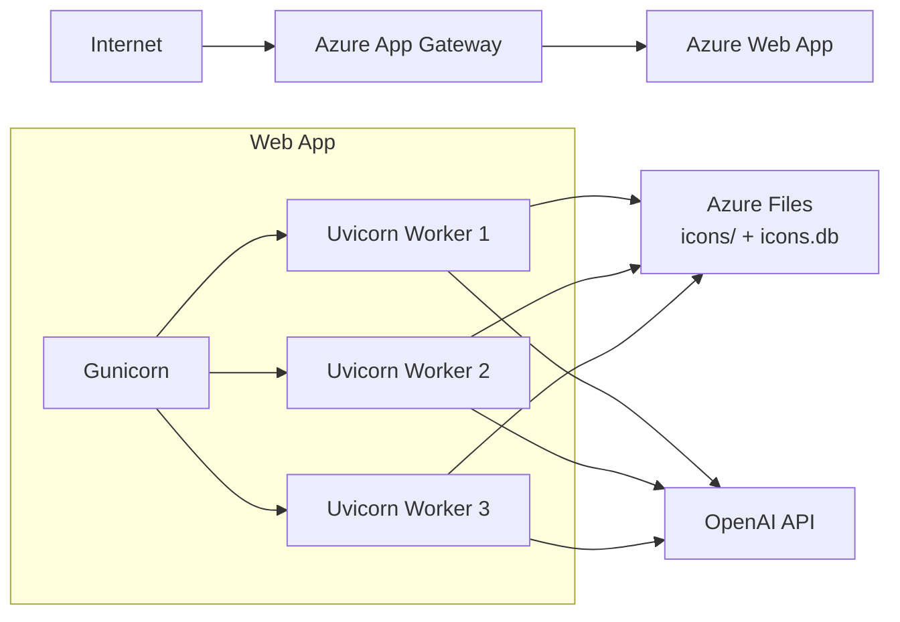

# Lingaro Icons Catalog - System Architecture

> 📖 **Related Documentation**: [Documentation Index](README.md) | [MCP Integration](mcp-integration.md) | [CLI Usage](cli-usage.md) | [User Journey](user-journey.md)

This document provides a comprehensive overview of the Lingaro Icons Catalog architecture, including all components, integrations, and data flows.

## High-Level Architecture



## Component Details

### 1. Client Interfaces

#### Web UI
- **Technology**: HTML, CSS, JavaScript (Vanilla)
- **Location**: `index.html`, `assets/`
- **Features**:
  - Responsive grid layout
  - Real-time search with debouncing
  - Category filtering
  - SVG preview and download
  - Clipboard copy (PNG conversion)
- **API Integration**: REST endpoints via `fetch()`

#### CLI Tool
- **Technology**: Python (Click framework)
- **Package**: `cli-anything-lingaro-catalog`
- **Commands**:
  - `search` - Search icons
  - `get` - Get icon details
  - `download` - Download icon files
  - `list` - List categories/sets
  - `configure` - Setup API connection
- **Output**: Table view or JSON

#### MCP Server
- **Technology**: Python (MCP SDK)
- **Location**: `lingaro-icons-plugin/mcp/server.py`
- **Tools**:
  - `search_icons` - Search with filters
  - `get_icon` - Get details by ID
  - `download_icon` - Download to local path
  - `list_sets` - List available icon sets
  - `list_categories` - Browse categories
- **Protocol**: stdio-based MCP

#### NPM Client
- **Package**: `@lingaro/icons-client`
- **Technology**: TypeScript
- **Features**:
  - Type-safe API client
  - React hooks (`useIcons`, `useSearch`)
  - Promise-based async API
- **Location**: `packages/icons-client/`

#### PowerPoint Add-in
- **Technology**: Office.js, JavaScript
- **Location**: `powerpoint-addin/`
- **Features**:
  - Task pane integration
  - Icon search and preview
  - Insert icons into slides
  - Distributed as `.ppam` file

### 2. API Layer

#### FastAPI Application
- **Entry Point**: `app.py` (uvicorn launcher)
- **Main Module**: `api/main.py`
- **Features**:
  - OpenAPI/Swagger docs at `/docs`
  - CORS enabled for web clients
  - Static file serving for web UI
  - Background task processing

#### API Routers

**Icons Router** (`api/routers/icons.py`)
- `GET /icons` - List icons (paginated)
- `GET /icons/{id}` - Get icon details
- `POST /icons` - Upload new icon (with background annotation)
- `PUT /icons/{id}` - Update icon metadata
- `DELETE /icons/{id}` - Remove icon
- `GET /icons/{id}/file` - Download SVG file

**Search Router** (`api/routers/search.py`)
- `GET /search` - Text and semantic search
- `GET /search/suggest` - Search suggestions
- Query parameters: `q`, `set_name`, `category`, `semantic`, `limit`

**Collections Router** (`api/routers/collections.py`)
- `GET /collections` - List collections
- `POST /collections` - Create collection
- `PUT /collections/{id}` - Update collection
- `DELETE /collections/{id}` - Delete collection
- `POST /collections/{id}/icons/{icon_id}` - Add icon to collection

**Auth Router** (`api/routers/auth.py`)
- `POST /auth/api-keys` - Generate API key
- `GET /auth/api-keys` - List user's API keys
- `DELETE /auth/api-keys/{id}` - Revoke API key

### 3. Business Logic

#### Search Engine (`api/search.py`)
- **Text Search**: SQLite FTS5 (Full-Text Search)
- **Semantic Search**: OpenAI embeddings + cosine similarity
- **Ranking**: Combines text match score with semantic similarity
- **Filters**: Icon set, category, tags

#### AI Annotator (`scripts/annotate.py`)
- Uses GPT-4 Vision to analyze SVG files
- Generates:
  - Human-readable descriptions
  - Relevant tags (comma-separated)
  - Category suggestions
- Batch processing with progress tracking

#### Icon Scanner (`scripts/scan_icons.py`)
- Recursively scans `icons/` directory
- Extracts metadata from SVG files:
  - Filename and path
  - Icon set (directory structure)
  - Category
  - SVG dimensions
- Generates `icons.json` (legacy format)

#### Embeddings Generator (`scripts/generate_embeddings.py`)
- Creates vector embeddings for each icon
- Input: Icon name + description + tags
- Model: OpenAI `text-embedding-ada-002`
- Stored in SQLite as JSON arrays

### 4. Data Storage

#### SQLite Database (`icons.db`)

**Schema**:
```sql
-- Icons table
CREATE TABLE icons (
    id TEXT PRIMARY KEY,
    name TEXT NOT NULL,
    set_name TEXT,
    category TEXT,
    file_path TEXT NOT NULL,
    description TEXT,
    tags TEXT,
    embedding TEXT,  -- JSON array
    created_at TIMESTAMP,
    updated_at TIMESTAMP
);

-- Full-text search index
CREATE VIRTUAL TABLE icons_fts USING fts5(
    name,
    description,
    tags,
    content=icons
);

-- Collections table
CREATE TABLE collections (
    id INTEGER PRIMARY KEY,
    name TEXT NOT NULL,
    description TEXT,
    cover_icon_id TEXT,
    created_at TIMESTAMP
);

-- Collection icons junction table
CREATE TABLE collection_icons (
    collection_id INTEGER,
    icon_id TEXT,
    PRIMARY KEY (collection_id, icon_id)
);

-- API keys table
CREATE TABLE api_keys (
    id INTEGER PRIMARY KEY,
    key_hash TEXT NOT NULL,
    name TEXT,
    created_at TIMESTAMP,
    last_used_at TIMESTAMP
);
```

#### Icon Files (`icons/`)
- **Format**: SVG (Scalable Vector Graphics)
- **Organization**:
  ```
  icons/
    Azure/
      compute/
      networking/
      ...
    GCP/
    Databricks/
    Microsoft Fabric/
    lingaro_set4/
      Abstract/
      Data Analysis Charts/
      ...
  ```
- **Naming**: kebab-case (e.g., `virtual-machine.svg`)
- **Color**: Consistent Lingaro purple (`#783cbe`)

#### Legacy Metadata (`assets/data/icons.json`)
- JSON file with all icon metadata
- Used for static site deployment
- Generated by `scan_icons.py`
- Includes embeddings for client-side search

### 5. External Services

#### OpenAI API
- **GPT-4 Vision**: Icon annotation
- **text-embedding-ada-002**: Semantic search
- **Configuration**: `OPENAI_API_KEY` environment variable
- **Fallback**: Works without API key (no AI features)

#### Azure Deployment
- **URL**: https://lingaro-icons-catalog.azurewebsites.net
- **Platform**: Azure Web App (Linux)
- **Server**: Gunicorn with uvicorn workers
- **Startup**:
  1. Database migration
  2. Icon scan
  3. Gunicorn start
- **Configuration**: `startup.txt`, `gunicorn.conf.py`

## Data Flow Examples

### Icon Upload Flow


### Search Flow (Semantic)


### MCP Tool Call Flow


## Deployment Architecture

### Development


### Production (Azure)


## Security

### API Authentication
- **Optional API Keys**: For remote access
- **Key Storage**: Hashed in SQLite
- **Header**: `X-API-Key: <token>`
- **Public Endpoints**: Web UI assets, icon files

### CORS
- **Enabled**: For cross-origin web requests
- **Origins**: Configurable via environment

### Input Validation
- **Pydantic Models**: Request/response validation
- **File Type**: SVG only for uploads
- **SQL Injection**: Protected by SQLAlchemy/parameterized queries

## Performance

### Caching
- **Static Assets**: Browser caching headers
- **API Responses**: No caching (real-time data)

### Database Optimization
- **Indexes**: Primary keys, FTS5 index
- **Connection Pooling**: SQLite with `check_same_thread=False`
- **Async**: FastAPI async endpoints

### Search Performance
- **Text Search**: ~10ms (FTS5)
- **Semantic Search**: ~200ms (includes OpenAI API call)
- **Hybrid**: Runs text search first, semantic if needed

## Technology Stack

| Component | Technology |
|-----------|-----------|
| API Framework | FastAPI 0.104+ |
| Web Server | Uvicorn / Gunicorn |
| Database | SQLite 3 |
| Search | FTS5 (text), OpenAI embeddings (semantic) |
| Web UI | HTML, CSS, Vanilla JS |
| CLI | Python Click |
| MCP Server | Python MCP SDK |
| NPM Package | TypeScript |
| Office Add-in | Office.js |
| AI Services | OpenAI GPT-4 Vision, Ada-002 |
| Deployment | Azure Web App (Linux) |

## Future Enhancements

- [ ] Redis caching layer for search results
- [ ] WebSocket support for real-time updates
- [ ] GraphQL API endpoint
- [ ] Icon versioning and history
- [ ] User accounts and private collections
- [ ] Advanced filtering (color, style, complexity)
- [ ] Icon generation via DALL-E
- [ ] Bulk import from design tools (Figma, Sketch)

---

## Related Documentation

- 📖 [Documentation Index](README.md) - Complete documentation overview
- 🔌 [MCP Integration](mcp-integration.md) - AI assistant integration guide
- 💻 [CLI Usage](cli-usage.md) - Command-line interface
- 👥 [User Journey](user-journey.md) - User experience workflows
- 📚 [Main README](../README.md) - Project overview
- 🚀 [Quick Start](../QUICK-START.md) - Getting started
- 📦 [Deployment](DEPLOYMENT.md) - Deployment guide
