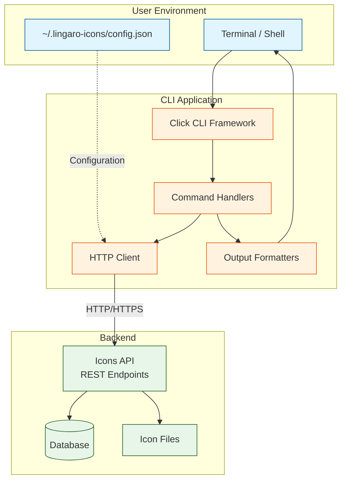
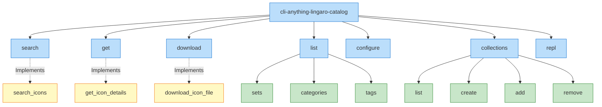
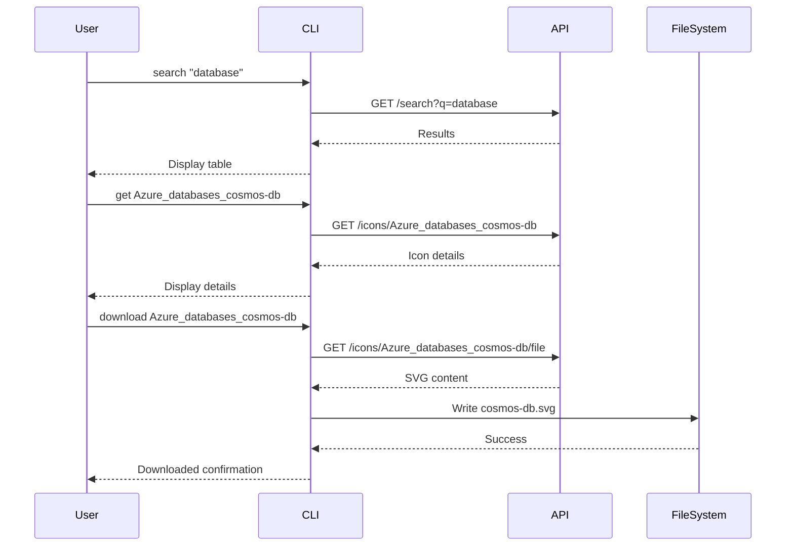
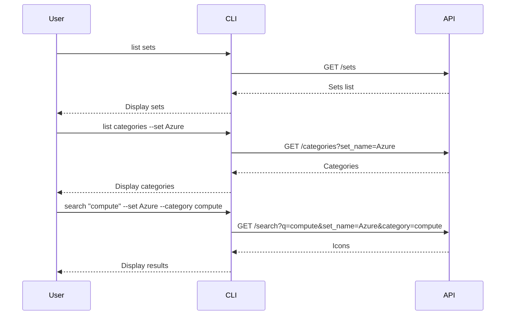

# CLI Architecture and Usage

> 📖 **Related Documentation**: [Documentation Index](README.md) | [Architecture](architecture.md) | [MCP Integration](mcp-integration.md) | [User Journey](user-journey.md)

This document describes the command-line interface (CLI) for the Lingaro Icons Catalog, providing developers with a terminal-based tool for searching, browsing, and downloading icons.

## Overview

The Lingaro Icons Catalog CLI is a Python-based command-line tool that provides full access to the catalog's features without requiring a web browser or API knowledge.



## Installation

### Via pip
```bash
pip install cli-anything-lingaro-catalog
```

### From Source
```bash
cd lingaro-icons-plugin/cli-src
pip install -e .
```

### Verify Installation
```bash
cli-anything-lingaro-catalog --version
# Output: cli-anything-lingaro-catalog, version 0.1.0
```

## CLI Architecture

### Command Structure



### Core Components

**Main Entry Point** (`lingaro_catalog_cli.py`):
```python
import click
from cli_anything.lingaro_catalog.core.client import CatalogClient
from cli_anything.lingaro_catalog.core.config import CLIConfig

@click.group()
@click.option("--json", "json_mode", is_flag=True)
@click.option("--url", envvar="LINGARO_CATALOG_URL")
@click.option("--api-key", envvar="LINGARO_API_KEY")
@click.pass_context
def cli(ctx, json_mode, url, api_key):
    """Main CLI group with global options"""
    config = CLIConfig.load()
    if url:
        config.base_url = url
    if api_key:
        config.api_key = api_key

    ctx.obj = Context(config, json_mode)
```

**HTTP Client** (`core/client.py`):
```python
import httpx

class CatalogClient:
    def __init__(self, base_url: str, api_key: str = None):
        self.base_url = base_url
        self.session = httpx.Client(
            base_url=base_url,
            headers=self._headers(api_key),
            timeout=30.0
        )

    def search(self, query: str, **filters) -> dict:
        """Search icons with filters"""
        params = {"q": query, **filters}
        response = self.session.get("/search", params=params)
        response.raise_for_status()
        return response.json()
```

**Output Formatters** (`utils/output.py`):
```python
from rich.console import Console
from rich.table import Table

console = Console()

def print_table(data: list[dict], columns: list[str]):
    """Print data as formatted table"""
    table = Table(show_header=True)
    for col in columns:
        table.add_column(col)

    for row in data:
        table.add_row(*[str(row.get(c, "")) for c in columns])

    console.print(table)

def print_json(data):
    """Print data as JSON"""
    import json
    print(json.dumps(data, indent=2))
```

## Command Reference

### Global Options

Available for all commands:

| Option | Environment Variable | Description | Default |
|--------|---------------------|-------------|---------|
| `--json` | - | Output as JSON | false |
| `--url` | `LINGARO_CATALOG_URL` | API base URL | https://lingaro-icons-catalog.azurewebsites.net |
| `--api-key` | `LINGARO_API_KEY` | API key for auth | None |
| `--help` | - | Show help message | - |

### search

Search for icons by keyword or semantic meaning.

**Syntax**:
```bash
cli-anything-lingaro-catalog search [OPTIONS] QUERY
```

**Options**:
- `-s, --set TEXT`: Filter by icon set (Azure, GCP, etc.)
- `-c, --category TEXT`: Filter by category
- `--semantic`: Use AI-powered semantic search
- `-l, --limit INT`: Maximum results (default: 10)

**Examples**:
```bash
# Basic keyword search
cli-anything-lingaro-catalog search "database"

# Search within Azure set
cli-anything-lingaro-catalog search "virtual machine" --set Azure

# Semantic search for concept
cli-anything-lingaro-catalog search "data warehouse" --semantic

# JSON output
cli-anything-lingaro-catalog --json search "kubernetes"
```

**Output (Table)**:
```
╭──────────────────────────────────────┬───────────┬─────────┬─────────────────────╮
│ ID                                   │ Name      │ Set     │ Category            │
├──────────────────────────────────────┼───────────┼─────────┼─────────────────────┤
│ Azure_databases_cosmos-db            │ cosmos-db │ Azure   │ databases           │
│ Azure_databases_sql-database         │ sql-db    │ Azure   │ databases           │
│ GCP_cloud_sql                        │ cloud-sql │ GCP     │ databases           │
╰──────────────────────────────────────┴───────────┴─────────┴─────────────────────╯
```

**Output (JSON)**:
```json
{
  "icons": [
    {
      "id": "Azure_databases_cosmos-db",
      "name": "cosmos-db",
      "set_name": "Azure",
      "category": "databases",
      "description": "Azure Cosmos DB - globally distributed NoSQL database",
      "tags": "database, nosql, cosmos, azure, cloud"
    }
  ],
  "total": 3
}
```

### get

Get detailed information about a specific icon.

**Syntax**:
```bash
cli-anything-lingaro-catalog get ICON_ID
```

**Examples**:
```bash
# Get icon details
cli-anything-lingaro-catalog get Azure_compute_virtualmachines

# JSON output
cli-anything-lingaro-catalog --json get Azure_compute_virtualmachines
```

**Output**:
```
Icon: virtualmachines
ID: Azure_compute_virtualmachines
Set: Azure
Category: compute
Description: Azure Virtual Machines - scalable cloud computing resources
Tags: vm, virtual machine, compute, iaas, azure
File: icons/Azure/compute/virtualmachines.svg
Download: https://lingaro-icons-catalog.azurewebsites.net/icons/Azure_compute_virtualmachines/file
```

### download

Download an icon file to the local filesystem.

**Syntax**:
```bash
cli-anything-lingaro-catalog download [OPTIONS] ICON_ID [PATH]
```

**Options**:
- `-o, --output PATH`: Output file path (default: current directory)
- `-f, --force`: Overwrite if file exists

**Examples**:
```bash
# Download to current directory
cli-anything-lingaro-catalog download Azure_compute_virtualmachines

# Download to specific path
cli-anything-lingaro-catalog download Azure_compute_virtualmachines -o ./icons/vm.svg

# Overwrite existing file
cli-anything-lingaro-catalog download Azure_compute_virtualmachines -o vm.svg --force
```

**Output**:
```
Downloaded: Azure_compute_virtualmachines
   Saved to: ./virtualmachines.svg
   Size: 2.4 KB
```

### list sets

List all available icon sets.

**Syntax**:
```bash
cli-anything-lingaro-catalog list sets
```

**Output**:
```
Available Icon Sets:

╭──────────────────┬───────────────────╮
│ Set              │ Icons             │
├──────────────────┼───────────────────┤
│ Azure            │ 1,247             │
│ GCP              │ 523               │
│ Databricks       │ 18                │
│ Microsoft Fabric │ 42                │
│ lingaro_set4     │ 248               │
╰──────────────────┴───────────────────╯
```

### list categories

List categories, optionally filtered by set.

**Syntax**:
```bash
cli-anything-lingaro-catalog list categories [OPTIONS]
```

**Options**:
- `-s, --set TEXT`: Filter by icon set

**Examples**:
```bash
# All categories
cli-anything-lingaro-catalog list categories

# Azure categories only
cli-anything-lingaro-catalog list categories --set Azure
```

**Output**:
```
Categories in Azure:

╭───────────────────────────┬───────────────╮
│ Category                  │ Icons         │
├───────────────────────────┼───────────────┤
│ ai + machine learning     │ 87            │
│ analytics                 │ 45            │
│ compute                   │ 132           │
│ databases                 │ 56            │
│ networking                │ 98            │
╰───────────────────────────┴───────────────╯
```

### list tags

List popular tags across all icons.

**Syntax**:
```bash
cli-anything-lingaro-catalog list tags [OPTIONS]
```

**Options**:
- `-l, --limit INT`: Number of tags to show (default: 20)

**Output**:
```
Popular Tags:

╭────────────────┬─────────────────╮
│ Tag            │ Icons           │
├────────────────┼─────────────────┤
│ azure          │ 1,247           │
│ cloud          │ 892             │
│ database       │ 156             │
│ compute        │ 234             │
╰────────────────┴─────────────────╯
```

### configure

Configure CLI settings (API URL, API key).

**Syntax**:
```bash
cli-anything-lingaro-catalog configure [OPTIONS]
```

**Options**:
- `--url TEXT`: Set API base URL
- `--api-key TEXT`: Set API key
- `--show`: Show current configuration

**Examples**:
```bash
# Interactive setup
cli-anything-lingaro-catalog configure

# Set URL
cli-anything-lingaro-catalog configure --url http://localhost:8000

# Show current config
cli-anything-lingaro-catalog configure --show
```

**Configuration File**: `~/.lingaro-icons/config.json`
```json
{
  "base_url": "https://lingaro-icons-catalog.azurewebsites.net",
  "api_key": "your-api-key-here"
}
```

### collections

Manage icon collections (requires API key).

**Subcommands**:
- `list`: List all collections
- `create NAME`: Create a new collection
- `add COLLECTION_ID ICON_ID`: Add icon to collection
- `remove COLLECTION_ID ICON_ID`: Remove icon from collection

**Examples**:
```bash
# List collections
cli-anything-lingaro-catalog collections list

# Create collection
cli-anything-lingaro-catalog collections create "Azure Architecture"

# Add icon to collection
cli-anything-lingaro-catalog collections add 1 Azure_compute_virtualmachines
```

### repl

Start interactive REPL mode for exploring the catalog.

**Syntax**:
```bash
cli-anything-lingaro-catalog repl
```

**Features**:
- Tab completion for commands
- Command history
- Multi-line editing
- Built-in help

**Example Session**:
```
Lingaro Icons Catalog REPL
Type 'help' for commands, 'exit' to quit

> search kubernetes
Searching for: kubernetes
Found 3 icons

> get Azure_containers_kubernetes-services
Icon: kubernetes-services
Set: Azure
...

> download Azure_containers_kubernetes-services ./k8s.svg
Downloaded to: ./k8s.svg

> exit
```

## Usage Workflows

### Workflow 1: Find and Download Icon



### Workflow 2: Explore by Category



### Workflow 3: Batch Download

**Script Example** (`download-azure-compute.sh`):
```bash
#!/bin/bash

# Get all Azure compute icons
OUTPUT_DIR="./azure-compute-icons"
mkdir -p "$OUTPUT_DIR"

# Search for compute icons
cli-anything-lingaro-catalog --json search "compute" \
  --set Azure \
  --category compute \
  --limit 100 > results.json

# Download each icon
jq -r '.icons[].id' results.json | while read icon_id; do
  cli-anything-lingaro-catalog download "$icon_id" \
    -o "$OUTPUT_DIR/${icon_id}.svg" \
    --force
done

echo "Downloaded $(ls $OUTPUT_DIR | wc -l) icons"
```

## Advanced Usage

### Piping and Scripting

**Filter search results**:
```bash
# Find Azure database icons and extract names
cli-anything-lingaro-catalog --json search "database" --set Azure \
  | jq -r '.icons[].name'
```

**Batch operations**:
```bash
# Download top 10 search results
cli-anything-lingaro-catalog --json search "cloud" --limit 10 \
  | jq -r '.icons[].id' \
  | xargs -I {} cli-anything-lingaro-catalog download {}
```

### Environment Configuration

**Use `.env` file**:
```bash
# .env
LINGARO_CATALOG_URL=http://localhost:8000
LINGARO_API_KEY=dev-key-12345
```

```bash
# Load environment
source .env

# CLI automatically picks up variables
cli-anything-lingaro-catalog search "test"
```

### Output Formatting

**Custom JSON processing**:
```bash
# Get icon URLs
cli-anything-lingaro-catalog --json search "azure" \
  | jq '.icons[] | {name: .name, url: .download_url}'
```

**CSV export**:
```bash
# Export search results as CSV
cli-anything-lingaro-catalog --json search "database" \
  | jq -r '.icons[] | [.id, .name, .set_name, .category] | @csv'
```

## Error Handling

### Common Errors

**Connection Refused**:
```bash
Error: Cannot connect to API at http://localhost:8000
Suggestion: Is the server running? Try: python app.py
```

**Authentication Required**:
```bash
Error: 401 Unauthorized
Suggestion: Set API key with:
  export LINGARO_API_KEY=your-key
  or
  cli-anything-lingaro-catalog configure --api-key your-key
```

**Icon Not Found**:
```bash
Error: Icon 'invalid-id' not found
Suggestion: Use search to find available icons:
  cli-anything-lingaro-catalog search "keyword"
```

### Debug Mode

**Enable verbose output**:
```bash
# Set environment variable
export CLI_DEBUG=1

# Run command
cli-anything-lingaro-catalog search "test"

# Output includes:
# DEBUG: API URL: http://localhost:8000
# DEBUG: Request: GET /search?q=test
# DEBUG: Response: 200 OK
```

## Performance Tips

1. **Use `--limit`**: Reduce network overhead
   ```bash
   cli-anything-lingaro-catalog search "azure" --limit 5
   ```

2. **Use `--json` for scripting**: Faster parsing
   ```bash
   cli-anything-lingaro-catalog --json search "test" | jq
   ```

3. **Cache results locally**: Avoid repeated API calls
   ```bash
   # Save results
   cli-anything-lingaro-catalog --json search "all" > cache.json

   # Query cache
   jq '.icons[] | select(.set_name == "Azure")' cache.json
   ```

4. **Use filters**: More efficient than client-side filtering
   ```bash
   # Good
   cli-anything-lingaro-catalog search "db" --set Azure --category databases

   # Less efficient
   cli-anything-lingaro-catalog --json search "db" | jq '.icons[] | select(.set_name == "Azure")'
   ```

## Integration Examples

### With Git Hooks

**Pre-commit hook** (`.git/hooks/pre-commit`):
```bash
#!/bin/bash
# Ensure all referenced icons exist

grep -oh "icons/[^\"]*\.svg" src/**/*.md | while read path; do
  icon_id=$(basename "$path" .svg)
  if ! cli-anything-lingaro-catalog get "$icon_id" &>/dev/null; then
    echo "Error: Icon $icon_id referenced but not in catalog"
    exit 1
  fi
done
```

### With CI/CD

**GitHub Actions** (`.github/workflows/icons.yml`):
```yaml
name: Update Icons
on:
  schedule:
    - cron: '0 0 * * 0'  # Weekly

jobs:
  update-icons:
    runs-on: ubuntu-latest
    steps:
      - uses: actions/checkout@v3

      - name: Install CLI
        run: pip install cli-anything-lingaro-catalog

      - name: Download Azure icons
        run: |
          mkdir -p assets/icons
          cli-anything-lingaro-catalog --json search "" --set Azure --limit 1000 \
            | jq -r '.icons[].id' \
            | xargs -I {} cli-anything-lingaro-catalog download {} -o assets/icons/{}.svg

      - name: Commit changes
        run: |
          git config user.name "Icon Bot"
          git add assets/icons
          git commit -m "Update Azure icons" || true
          git push
```

### With Make

**Makefile**:
```makefile
.PHONY: download-icons
download-icons:
	@mkdir -p icons/azure icons/gcp
	@echo "Downloading Azure icons..."
	@cli-anything-lingaro-catalog --json search "" --set Azure --limit 100 \
	  | jq -r '.icons[].id' \
	  | xargs -P 4 -I {} cli-anything-lingaro-catalog download {} -o icons/azure/{}.svg
	@echo "Downloading GCP icons..."
	@cli-anything-lingaro-catalog --json search "" --set GCP --limit 100 \
	  | jq -r '.icons[].id' \
	  | xargs -P 4 -I {} cli-anything-lingaro-catalog download {} -o icons/gcp/{}.svg

.PHONY: list-missing
list-missing:
	@grep -roh 'icons/[^"]*\.svg' docs/ \
	  | sort -u \
	  | while read path; do \
	      [ -f "$$path" ] || echo "Missing: $$path"; \
	    done
```

## Best Practices

1. **Use semantic search for concepts**: Better for abstract queries
2. **Use keyword search for exact matches**: Faster and more predictable
3. **Filter by set/category**: Reduces result sets
4. **Download to organized directories**: Group by set or category
5. **Version control icons**: Track icon updates in git
6. **Automate updates**: Use CI/CD for regular syncs
7. **Cache search results**: Avoid repeated API calls in scripts
8. **Use JSON mode in scripts**: Easier to parse programmatically

---

## Related Documentation

- 📖 [Documentation Index](README.md) - Complete documentation overview
- 🏗️ [System Architecture](architecture.md) - See [CLI Tool Architecture](architecture.md#cli-tool)
- 🔌 [MCP Integration](mcp-integration.md) - Alternative AI assistant interface
- 👥 [User Journey](user-journey.md) - See [DevOps Journey](user-journey.md#journey-5-devops-engineer-automating-icon-updates)
- 📚 [Main README](../README.md) - Project overview
- 🚀 [Quick Start](../QUICK-START.md) - Getting started

## Quick Reference

### Common Commands
```bash
# Search
cli-anything-lingaro-catalog search "kubernetes" --set Azure

# Download
cli-anything-lingaro-catalog download Azure_containers_kubernetes-services

# List
cli-anything-lingaro-catalog list sets
cli-anything-lingaro-catalog list categories --set Azure

# Configure
cli-anything-lingaro-catalog configure --url http://localhost:8000
```

### Output Formats
- **Table**: Default, human-readable
- **JSON**: Use `--json` flag for scripting

### Environment Variables
- `LINGARO_CATALOG_URL`: API base URL
- `LINGARO_API_KEY`: Optional API key

### Configuration File
- **Location**: `~/.lingaro-icons/config.json`
- **Edit**: `cli-anything-lingaro-catalog configure`
