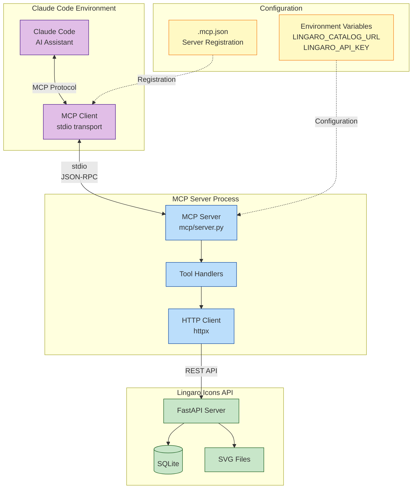
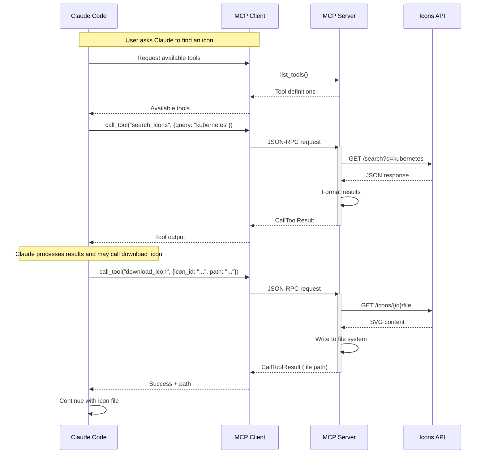
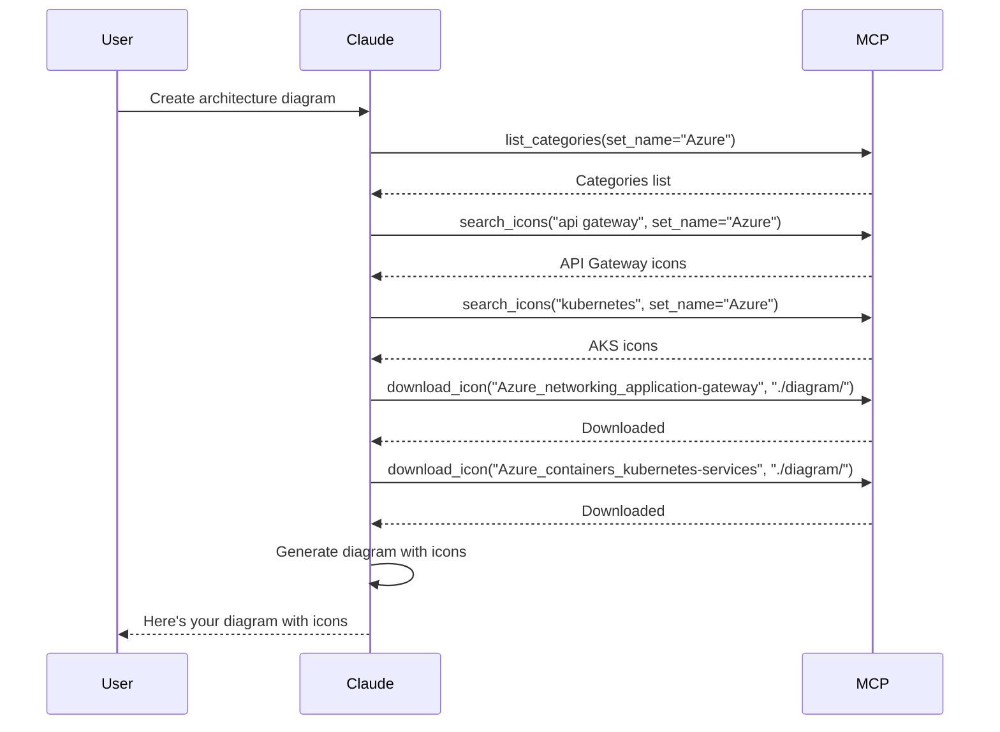

# MCP Integration Architecture

> 📖 **Related Documentation**: [Documentation Index](README.md) | [Architecture](architecture.md) | [CLI Usage](cli-usage.md) | [User Journey](user-journey.md)

This document describes the Model Context Protocol (MCP) server integration for the Lingaro Icons Catalog, enabling Claude Code and other MCP clients to search and download icons directly.

## Overview

The Lingaro Icons Catalog MCP server provides a programmatic interface for AI assistants to discover and use icons from the catalog without requiring manual CLI commands or web browsing.



## MCP Server Architecture

### Server Implementation

**Location**: `lingaro-icons-plugin/mcp/server.py`

**Key Components**:
```python
from mcp.server import Server
from mcp.server.stdio import stdio_server
from mcp.types import Tool, TextContent, CallToolResult
import httpx

# Server instance
server = Server("lingaro-catalog")

# Tool registration
@server.list_tools()
async def list_tools() -> list[Tool]:
    return [
        Tool(name="search_icons", ...),
        Tool(name="get_icon", ...),
        Tool(name="download_icon", ...),
        # ... more tools
    ]

# Tool execution
@server.call_tool()
async def call_tool(name: str, arguments: dict) -> CallToolResult:
    if name == "search_icons":
        return await handle_search(arguments)
    # ... other handlers
```

### Communication Flow



## Available MCP Tools

### 1. search_icons

Search the icon catalog by keyword or semantic meaning.

**Input Schema**:
```json
{
  "query": "string (required)",
  "set_name": "string (optional) - Azure, GCP, Databricks, etc.",
  "category": "string (optional) - filter by category",
  "semantic": "boolean (optional) - use AI search",
  "limit": "integer (optional) - max results, default 10"
}
```

**Example Call**:
```python
# Via Claude Code
result = mcp.call_tool("search_icons", {
    "query": "cloud database",
    "set_name": "Azure",
    "semantic": True,
    "limit": 5
})
```

**Output Format**:
```
Found 5 icons:

ID: Azure_databases_cosmos-db
Name: cosmos-db
Set: Azure
Category: databases
Description: Azure Cosmos DB - globally distributed NoSQL database
Tags: database, nosql, cosmos, azure, cloud

ID: Azure_databases_sql-database
Name: sql-database
Set: Azure
...
```

### 2. get_icon

Retrieve detailed information about a specific icon.

**Input Schema**:
```json
{
  "icon_id": "string (required) - The icon ID"
}
```

**Example Call**:
```python
result = mcp.call_tool("get_icon", {
    "icon_id": "Azure_compute_virtualmachines"
})
```

**Output Format**:
```
ID: Azure_compute_virtualmachines
Name: virtualmachines
Set: Azure
Category: compute
Description: Azure Virtual Machines - scalable cloud compute
Tags: vm, virtual machine, compute, azure, iaas
Download URL: https://lingaro-icons-catalog.azurewebsites.net/icons/Azure_compute_virtualmachines/file
```

### 3. download_icon

Download an icon file to the local filesystem.

**Input Schema**:
```json
{
  "icon_id": "string (required) - The icon ID",
  "path": "string (required) - Local file path",
  "overwrite": "boolean (optional) - Overwrite if exists, default false"
}
```

**Example Call**:
```python
result = mcp.call_tool("download_icon", {
    "icon_id": "Azure_compute_virtualmachines",
    "path": "./diagrams/vm-icon.svg",
    "overwrite": True
})
```

**Output**:
```
Downloaded icon to: ./diagrams/vm-icon.svg
Icon: virtualmachines (Azure/compute)
```

### 4. list_sets

List all available icon sets in the catalog.

**Input Schema**:
```json
{}
```

**Example Call**:
```python
result = mcp.call_tool("list_sets", {})
```

**Output**:
```
Available icon sets (5):
- Azure (1,247 icons)
- GCP (523 icons)
- Databricks (18 icons)
- Microsoft Fabric (42 icons)
- lingaro_set4 (248 icons)
```

### 5. list_categories

Browse icons by category within a set.

**Input Schema**:
```json
{
  "set_name": "string (optional) - filter by icon set"
}
```

**Example Call**:
```python
result = mcp.call_tool("list_categories", {
    "set_name": "Azure"
})
```

**Output**:
```
Categories in Azure (15):
- ai + machine learning (87 icons)
- analytics (45 icons)
- compute (132 icons)
- databases (56 icons)
- networking (98 icons)
...
```

## Configuration

### MCP Server Registration

**File**: `.mcp.json` (project root) or `lingaro-icons-plugin/.mcp.json`

```json
{
  "mcpServers": {
    "lingaro-catalog": {
      "command": "python",
      "args": ["${CLAUDE_PLUGIN_ROOT}/mcp/server.py"],
      "env": {
        "LINGARO_CATALOG_URL": "${LINGARO_CATALOG_URL}",
        "LINGARO_API_KEY": "${LINGARO_API_KEY}"
      }
    }
  }
}
```

**Variables**:
- `${CLAUDE_PLUGIN_ROOT}`: Resolved by Claude Code to plugin directory
- `${LINGARO_CATALOG_URL}`: Defaults to production URL if not set
- `${LINGARO_API_KEY}`: Optional, for authenticated access

### Environment Variables

**LINGARO_CATALOG_URL**
- **Purpose**: Base URL of the Icons API
- **Default**: `https://lingaro-icons-catalog.azurewebsites.net`
- **Local Development**: `http://localhost:8000`

**LINGARO_API_KEY**
- **Purpose**: Personal API token for authenticated requests
- **Default**: None (works for public endpoints)
- **Required For**: Private collections, upload, admin operations

**Setup Example**:
```bash
# Windows PowerShell
$Env:LINGARO_CATALOG_URL = "http://localhost:8000"
$Env:LINGARO_API_KEY = "your-api-key-here"

# Linux/macOS
export LINGARO_CATALOG_URL="http://localhost:8000"
export LINGARO_API_KEY="your-api-key-here"
```

### Plugin Installation

**Via Claude Code Skill**:
```
/lingaro-icons:configure
```

**Manual Setup**:
1. Install Python dependencies:
   ```bash
   cd lingaro-icons-plugin
   pip install -r requirements.txt
   ```

2. Register MCP server:
   - Copy `.mcp.json` to project root or `~/.claude/`
   - Set environment variables if needed

3. Restart Claude Code to load the server

## Protocol Details

### Transport Layer

**Protocol**: stdio (standard input/output)
- Server runs as a subprocess of Claude Code
- Communication via JSON-RPC 2.0 over stdin/stdout
- Binary data (icon files) encoded as base64 or written to filesystem

**Message Format**:
```json
{
  "jsonrpc": "2.0",
  "method": "tools/call",
  "params": {
    "name": "search_icons",
    "arguments": {
      "query": "kubernetes"
    }
  },
  "id": 1
}
```

**Response Format**:
```json
{
  "jsonrpc": "2.0",
  "result": {
    "content": [
      {
        "type": "text",
        "text": "Found 3 icons:\n\nID: ..."
      }
    ]
  },
  "id": 1
}
```

### Error Handling

**MCP Server Errors**:
```python
# HTTP errors from API
try:
    response = client.get(f"/icons/{icon_id}")
    response.raise_for_status()
except httpx.HTTPStatusError as e:
    return CallToolResult(
        content=[TextContent(
            type="text",
            text=f"Error: {e.response.status_code} - {e.response.text}"
        )]
    )

# Network errors
except httpx.RequestError as e:
    return CallToolResult(
        content=[TextContent(
            type="text",
            text=f"Network error: Cannot reach {BASE_URL}"
        )]
    )
```

**Claude Code Handling**:
- Displays error messages to user
- May retry with different parameters
- Falls back to alternative tools if available

## Use Cases

### 1. Architecture Diagram Creation

**User Request**: "Create an architecture diagram for a microservices app on Azure"

**Claude's MCP Workflow**:


### 2. Presentation Icon Search

**User Request**: "Find me icons for a data analytics presentation"

**Claude's MCP Workflow**:
```python
# 1. Semantic search for relevant icons
icons = mcp.search_icons(
    query="data analytics visualization dashboard",
    semantic=True,
    limit=20
)

# 2. Filter by set preference
azure_icons = [i for i in icons if i.set_name == "Azure"]
lingaro_icons = [i for i in icons if i.set_name == "lingaro_set4"]

# 3. Present options to user with descriptions
```

### 3. Batch Icon Download

**User Request**: "Download all Azure database icons"

**Claude's MCP Workflow**:
```python
# 1. List categories
categories = mcp.list_categories(set_name="Azure")

# 2. Search database category
db_icons = mcp.search_icons(
    query="database",
    set_name="Azure",
    category="databases",
    limit=100
)

# 3. Download each icon
for icon in db_icons:
    mcp.download_icon(
        icon_id=icon.id,
        path=f"./icons/azure-databases/{icon.name}.svg"
    )
```

## Performance Considerations

### Caching
- **MCP Server**: No internal caching (stateless)
- **API**: May cache search results
- **Claude Code**: Caches tool definitions

### Rate Limiting
- **API**: No rate limits for authenticated requests
- **Public API**: May implement rate limiting in future
- **OpenAI**: Semantic search limited by OpenAI API quotas

### Concurrent Requests
- **MCP Server**: Single-threaded (stdio)
- **API**: Supports concurrent requests
- **Recommendation**: Sequential tool calls from Claude

## Security

### API Key Protection
- Never logged or displayed
- Passed in HTTP headers only
- Stored securely in environment variables

### File System Access
- MCP server writes to user-specified paths only
- No automatic file execution
- Path validation to prevent directory traversal

### Network Security
- HTTPS for production API
- Certificate validation enabled
- Timeout protection (30s default)

## Troubleshooting

### Server Not Starting

**Symptom**: MCP server not available in Claude Code

**Solutions**:
1. Check Python installation:
   ```bash
   python -c "import mcp; print('MCP installed')"
   ```

2. Verify `.mcp.json` location:
   - Project root: `./.mcp.json`
   - User config: `~/.claude/mcp.json`

3. Check logs in Claude Code:
   - Look for server startup errors
   - Verify command path

### Connection Refused

**Symptom**: "Network error: Cannot reach API"

**Solutions**:
1. Check API URL:
   ```bash
   echo $LINGARO_CATALOG_URL
   curl $LINGARO_CATALOG_URL/health
   ```

2. Start local server if testing:
   ```bash
   python app.py
   ```

3. Check firewall/proxy settings

### Authentication Errors

**Symptom**: "401 Unauthorized" or "403 Forbidden"

**Solutions**:
1. Verify API key:
   ```bash
   echo $LINGARO_API_KEY
   ```

2. Test key directly:
   ```bash
   curl -H "X-API-Key: $LINGARO_API_KEY" \
     $LINGARO_CATALOG_URL/icons
   ```

3. Generate new key via web UI or admin

## Development

### Running MCP Server Standalone

**For Testing**:
```bash
cd lingaro-icons-plugin

# Set environment
export LINGARO_CATALOG_URL=http://localhost:8000

# Run server (stdio mode)
python mcp/server.py

# Test with MCP inspector
npx @modelcontextprotocol/inspector python mcp/server.py
```

### Adding New Tools

**Steps**:
1. Define tool in `list_tools()`:
   ```python
   Tool(
       name="new_tool",
       description="What it does",
       inputSchema={...}
   )
   ```

2. Implement handler in `call_tool()`:
   ```python
   if name == "new_tool":
       return await handle_new_tool(arguments)
   ```

3. Test with MCP inspector
4. Update documentation

### Debugging

**Enable Verbose Logging**:
```python
# In server.py
import logging
logging.basicConfig(level=logging.DEBUG)
logger = logging.getLogger(__name__)

logger.debug(f"Calling API: {url}")
logger.debug(f"Response: {response.text}")
```

**Capture stdio Traffic**:
```bash
# Redirect stderr to file
python mcp/server.py 2>mcp-debug.log
```

## Best Practices

### For MCP Tool Design
1. **Clear Descriptions**: Help Claude understand when to use each tool
2. **Flexible Parameters**: Support both required and optional arguments
3. **Rich Output**: Provide context, not just data
4. **Error Messages**: Actionable guidance for failures

### For Claude Integration
1. **Progressive Search**: Start broad, refine with filters
2. **Batch Operations**: Group related downloads
3. **Path Organization**: Use consistent directory structures
4. **Semantic Search**: Use for conceptual queries, not exact matches

### For API Efficiency
1. **Use Filters**: Reduce result sets with `set_name`, `category`
2. **Limit Results**: Don't request more icons than needed
3. **Cache Locally**: Download once, reuse files
4. **Avoid Polling**: MCP is request/response, not real-time

---

## Related Documentation

- 📖 [Documentation Index](README.md) - Complete documentation overview
- 🏗️ [System Architecture](architecture.md) - Technical architecture
- 💻 [CLI Usage](cli-usage.md) - Alternative command-line interface
- 👥 [User Journey](user-journey.md) - See [Claude Code Journey](user-journey.md#journey-3-claude-code-user-building-architecture-diagram)
- 📚 [Main README](../README.md) - Project overview
- 🚀 [Quick Start](../QUICK-START.md) - Getting started

## Quick Reference

### MCP Tools
- [`search_icons`](#1-search_icons) - Search catalog
- [`get_icon`](#2-get_icon) - Get icon details
- [`download_icon`](#3-download_icon) - Download to filesystem
- [`list_sets`](#4-list_sets) - Available icon sets
- [`list_categories`](#5-list_categories) - Browse categories

### Configuration
- [Server Registration](#mcp-server-registration)
- [Environment Variables](#environment-variables)
- [Plugin Installation](#plugin-installation)

### Troubleshooting
- [Server Not Starting](#server-not-starting)
- [Connection Refused](#connection-refused)
- [Authentication Errors](#authentication-errors)
