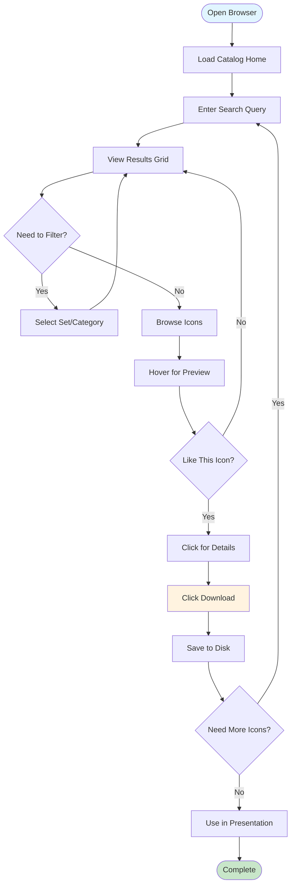
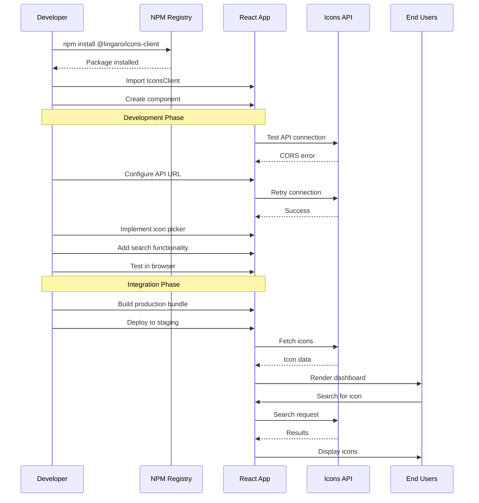
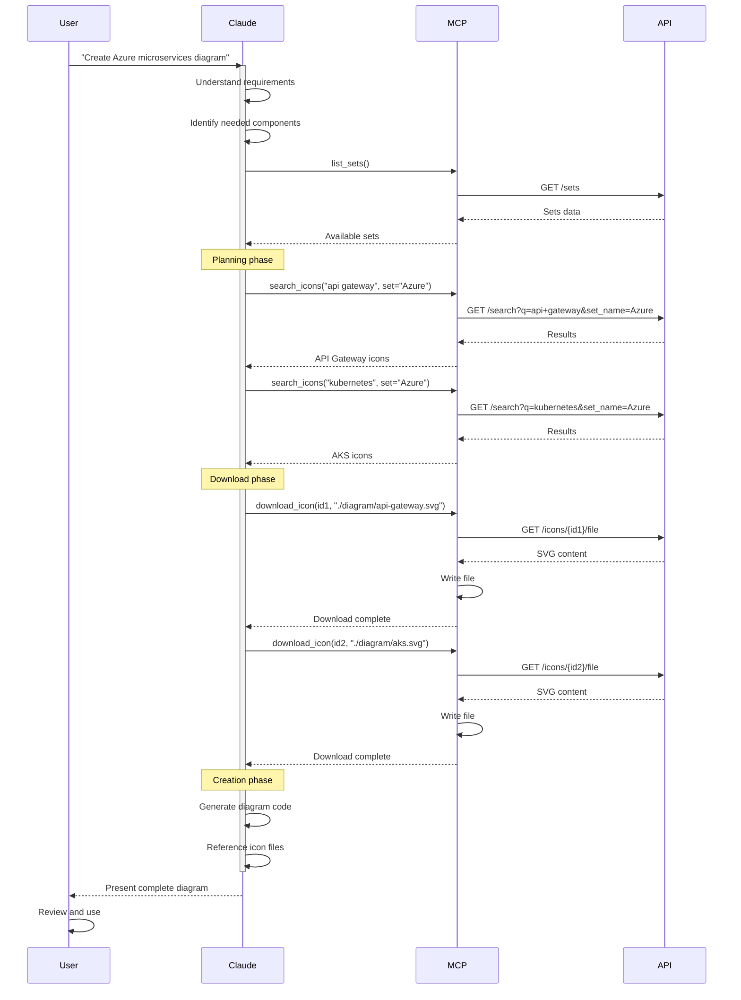
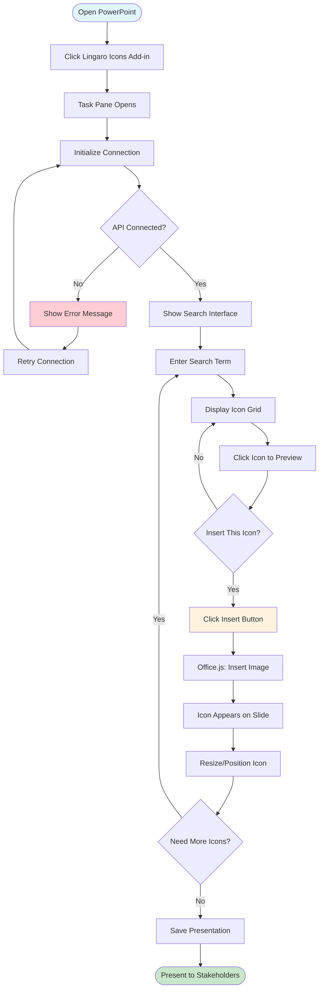
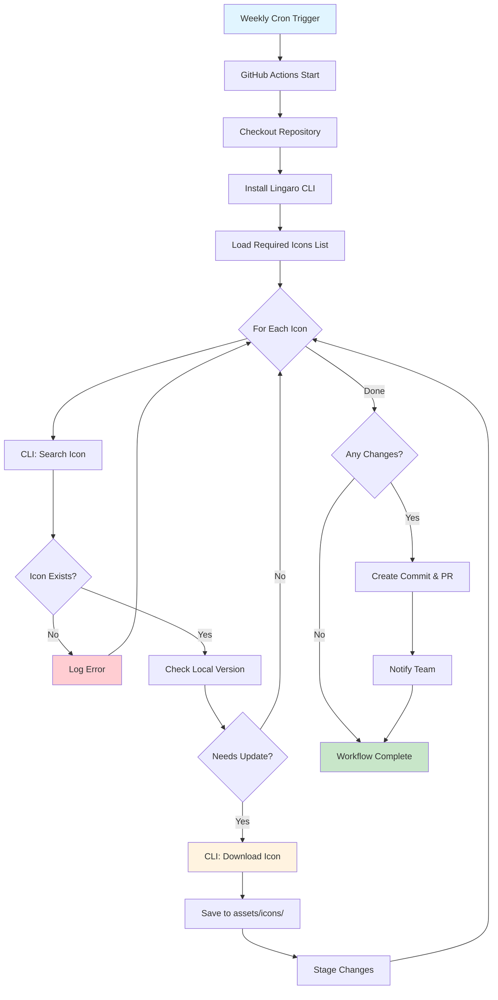
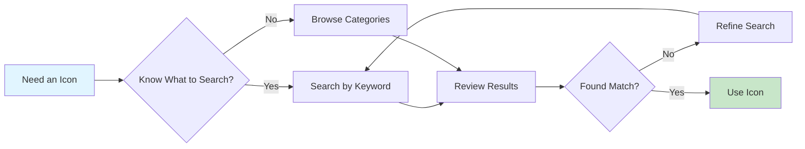
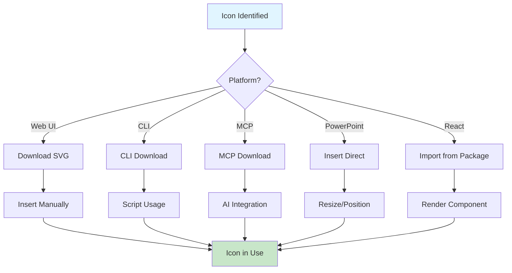
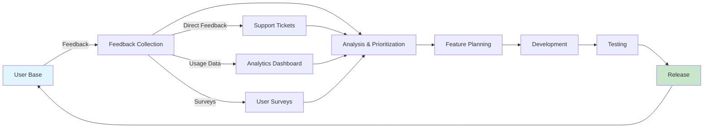

# User Journey and Workflows

> 📖 **Related Documentation**: [Documentation Index](README.md) | [Architecture](architecture.md) | [MCP Integration](mcp-integration.md) | [CLI Usage](cli-usage.md)

This document maps out the complete user experience across all interfaces of the Lingaro Icons Catalog, showing how different user personas interact with the system.

## User Personas

```mermaid
graph TB
    Root[Lingaro Icons Catalog]

    Root --> WebUsers[Web Users]
    Root --> Developers
    Root --> AIAssistants[AI Assistants]
    Root --> OfficeUsers[Office Users]

    WebUsers --> Marketing[Marketing Team]
    WebUsers --> Designers
    WebUsers --> Executives

    Marketing --> MP1[Creating presentations]
    Marketing --> MP2[Designing materials]

    Designers --> D1[Finding brand icons]
    Designers --> D2[Building mockups]

    Executives --> E1[Browsing catalog]
    Executives --> E2[Quick downloads]

    Developers --> FrontendDevs[Frontend Devs]
    Developers --> BackendDevs[Backend Devs]
    Developers --> DevOps

    FrontendDevs --> FD1[Integrating icons]
    FrontendDevs --> FD2[React apps]

    BackendDevs --> BD1[API integration]
    BackendDevs --> BD2[Automation]

    DevOps --> DO1[CI/CD pipelines]
    DevOps --> DO2[Icon versioning]

    AIAssistants --> Claude[Claude Code]
    AIAssistants --> OtherAI[Other AI]

    Claude --> C1[Architecture diagrams]
    Claude --> C2[Code generation]

    OtherAI --> O1[Documentation]
    OtherAI --> O2[Automation]

    OfficeUsers --> PowerPoint
    OfficeUsers --> BA[Business Analysts]

    PowerPoint --> P1[Slide decks]
    PowerPoint --> P2[Presentations]

    BA --> BA1[Documentation]
    BA --> BA2[Reports]

    classDef persona fill:#e1bee7,stroke:#4a148c
    classDef activity fill:#bbdefb,stroke:#1976d2

    class Root,WebUsers,Developers,AIAssistants,OfficeUsers persona
    class Marketing,Designers,Executives,FrontendDevs,BackendDevs,DevOps,Claude,OtherAI,PowerPoint,BA persona
```



## Journey Maps

### Journey 1: Marketing Team Member Creating Presentation

> 📘 **Related**: [Web UI Architecture](architecture.md#web-ui)

**Persona**: Sarah, Marketing Manager
**Goal**: Find Azure icons for a client presentation
**Entry Point**: Web UI

**Journey Steps** (Satisfaction scores 1-5):

| Phase | Steps | Satisfaction |
|-------|-------|--------------|
| **Discovery** | Open web browser → Navigate to catalog → See landing page with search | ⭐⭐⭐⭐⭐ (5/5) |
| **Search** | Type "Azure database" → View grid → Filter by "Azure" → Preview icons | ⭐⭐⭐⭐⭐ (5/5) |
| **Selection** | Click icon → Read details → Download SVG → Save to folder | ⭐⭐⭐⭐⭐ (5/5) |
| **Usage** | Open PowerPoint → Insert SVG → Resize & position → Add more icons | ⭐⭐⭐⭐ (4/5) |
| **Outcome** | Complete presentation → Share with team | ⭐⭐⭐⭐⭐ (5/5) |

**Detailed Flow**:



**Key Touchpoints**:
1. **Discovery**: Google search → Catalog homepage
2. **Search**: Simple search bar, instant results
3. **Browse**: Visual grid with hover previews
4. **Details**: Click card → detailed view
5. **Download**: One-click SVG download
6. **Usage**: Insert into PowerPoint/Keynote

**Pain Points Addressed**:
- ✅ No login required
- ✅ Visual search results
- ✅ Instant download
- ✅ High-quality SVG format

### Journey 2: Developer Integrating Icons into React App

> 📘 **Related**: [NPM Client Architecture](architecture.md#npm-client) | [API Documentation](architecture.md#api-layer)

**Persona**: Alex, Frontend Developer
**Goal**: Add Lingaro icons to company dashboard
**Entry Point**: NPM Package

**Journey Steps** (Satisfaction scores 1-5):

| Phase | Steps | Satisfaction |
|-------|-------|--------------|
| **Setup** | Read documentation → Install NPM package → Configure API key | ⭐⭐⭐⭐ (4/5) |
| **Development** | Import IconsClient → Create component → Test rendering → Debug CORS → Fix & retest | ⭐⭐⭐⭐ (4/5) |
| **Integration** | Add to dashboard → Implement icon picker → Test user flow | ⭐⭐⭐⭐⭐ (5/5) |
| **Deployment** | Build production → Deploy to staging → Verify in production | ⭐⭐⭐⭐⭐ (5/5) |

**Detailed Flow**:



**Code Example**:

```typescript
// 1. Install
// npm install @lingaro/icons-client

// 2. Import
import { IconsClient, useIcons } from '@lingaro/icons-client';

// 3. Initialize
const client = new IconsClient({
  baseUrl: 'https://lingaro-icons-catalog.azurewebsites.net',
  apiKey: process.env.REACT_APP_LINGARO_API_KEY
});

// 4. Use in component
function IconPicker() {
  const [query, setQuery] = useState('');
  const { data, loading, error } = useIcons(client, {
    query,
    setName: 'Azure'
  });

  if (loading) return <Spinner />;
  if (error) return <Error message={error.message} />;

  return (
    <div>
      <SearchBar value={query} onChange={setQuery} />
      <IconGrid icons={data.icons} />
    </div>
  );
}
```

**Key Touchpoints**:
1. **Documentation**: README, API docs
2. **Installation**: NPM package manager
3. **Configuration**: API key, base URL
4. **Development**: TypeScript types, React hooks
5. **Testing**: Local dev server
6. **Deployment**: Production build

**Pain Points Addressed**:
- ✅ TypeScript support
- ✅ React hooks for easy integration
- ✅ Comprehensive documentation
- ✅ Error handling built-in

### Journey 3: Claude Code User Building Architecture Diagram

> 📘 **Related**: [MCP Integration Guide](mcp-integration.md) | [Available MCP Tools](mcp-integration.md#available-mcp-tools) | [MCP Configuration](mcp-integration.md#configuration)

**Persona**: Claude, AI Assistant
**Goal**: Help user create Azure architecture diagram
**Entry Point**: MCP Server

**Journey Steps** (Satisfaction scores 1-5):

| Phase | Steps | Satisfaction |
|-------|-------|--------------|
| **Initialization** | User asks for diagram → Claude loads MCP tools → List available sets | ⭐⭐⭐⭐⭐ (5/5) |
| **Planning** | Identify needed icons → Search for components → Filter by Azure | ⭐⭐⭐⭐⭐ (5/5) |
| **Icon Collection** | Download API Gateway → Kubernetes → Database → Storage icons | ⭐⭐⭐⭐⭐ (5/5) |
| **Diagram Creation** | Generate Mermaid diagram → Reference icons → Add labels & connections | ⭐⭐⭐⭐⭐ (5/5) |
| **Delivery** | Present diagram → Provide file paths → Explain architecture | ⭐⭐⭐⭐⭐ (5/5) |

**Detailed Flow**:



**Example Interaction**:

```
User: Create an architecture diagram for a microservices app on Azure with:
- API Gateway
- Kubernetes cluster
- SQL Database
- Blob Storage

Claude: I'll create that diagram using icons from the Lingaro catalog.

[MCP: search_icons("api gateway", set_name="Azure")]
[MCP: search_icons("kubernetes", set_name="Azure")]
[MCP: search_icons("sql database", set_name="Azure")]
[MCP: search_icons("blob storage", set_name="Azure")]

I found the icons. Let me download them:

[MCP: download_icon("Azure_networking_application-gateway", "./diagram/api-gateway.svg")]
[MCP: download_icon("Azure_containers_kubernetes-services", "./diagram/aks.svg")]
[MCP: download_icon("Azure_databases_sql-database", "./diagram/sql-db.svg")]
[MCP: download_icon("Azure_storage_storage-accounts", "./diagram/blob-storage.svg")]

Here's your architecture diagram:

[Generated diagram with icons]
```

**Key Touchpoints**:
1. **Tool Discovery**: MCP tool listing
2. **Search**: Semantic and keyword search
3. **Download**: Automated file retrieval
4. **Integration**: Direct use in generated content
5. **Context**: Icons enhance AI's explanation

**Pain Points Addressed**:
- ✅ No manual icon search needed
- ✅ Automated download process
- ✅ Consistent icon usage
- ✅ Professional diagram output

### Journey 4: Business Analyst Using PowerPoint Add-in

> 📘 **Related**: [PowerPoint Add-in Architecture](architecture.md#powerpoint-add-in)

**Persona**: Mike, Business Analyst
**Goal**: Create architecture slide for stakeholder meeting
**Entry Point**: PowerPoint Add-in

**Journey Steps** (Satisfaction scores 1-5):

| Phase | Steps | Satisfaction |
|-------|-------|--------------|
| **Preparation** | Open PowerPoint → Load template → Open Lingaro Icons add-in | ⭐⭐⭐⭐ (4/5) |
| **Icon Search** | Search for "data pipeline" → Browse results → Preview icon | ⭐⭐⭐⭐⭐ (5/5) |
| **Insertion** | Click "Insert Icon" → Icon appears → Resize & position → Search next | ⭐⭐⭐⭐⭐ (5/5) |
| **Completion** | Arrange all icons → Add labels and arrows → Save presentation | ⭐⭐⭐⭐⭐ (5/5) |
| **Presentation** | Present to stakeholders → Professional appearance → Get approval | ⭐⭐⭐⭐⭐ (5/5) |

**Detailed Flow**:



**Add-in Interface**:

```
┌─────────────────────────────────────┐
│ Lingaro Icons                    [X]│
├─────────────────────────────────────┤
│ Search: [data pipeline______] [🔍] │
├─────────────────────────────────────┤
│ Filters:                            │
│ Set: [Azure ▼]  Category: [All ▼]  │
├─────────────────────────────────────┤
│ ┌───────┐ ┌───────┐ ┌───────┐      │
│ │ [Icon]│ │ [Icon]│ │ [Icon]│      │
│ │ Data  │ │ ETL   │ │Stream │      │
│ │Factory│ │       │ │       │      │
│ └───────┘ └───────┘ └───────┘      │
│ ┌───────┐ ┌───────┐ ┌───────┐      │
│ │ [Icon]│ │ [Icon]│ │ [Icon]│      │
│ │Synapse│ │ Batch │ │ Queue │      │
│ │       │ │       │ │       │      │
│ └───────┘ └───────┘ └───────┘      │
├─────────────────────────────────────┤
│ Selected: Data Factory              │
│ [Preview]         [Insert to Slide] │
└─────────────────────────────────────┘
```

**Key Touchpoints**:
1. **Add-in Launch**: From PowerPoint ribbon
2. **Search**: Real-time search as you type
3. **Preview**: See icon before inserting
4. **Insert**: One-click insertion to slide
5. **Manipulation**: Standard PowerPoint tools

**Pain Points Addressed**:
- ✅ No browser switching
- ✅ Direct insertion to slide
- ✅ Native PowerPoint integration
- ✅ No file management needed

### Journey 5: DevOps Engineer Automating Icon Updates

> 📘 **Related**: [CLI Usage Guide](cli-usage.md) | [CLI Commands](cli-usage.md#command-reference) | [CI/CD Examples](cli-usage.md#integration-examples)

**Persona**: Jordan, DevOps Engineer
**Goal**: Keep project icons synchronized with catalog
**Entry Point**: CLI + CI/CD

**Journey Steps** (Satisfaction scores 1-5):

| Phase | Steps | Satisfaction |
|-------|-------|--------------|
| **Initial Setup** | Install CLI tool → Configure API credentials → Test commands | ⭐⭐⭐⭐ (4/5) |
| **Script Development** | Write update script → Test locally → Handle errors → Refine script | ⭐⭐⭐⭐ (4/5) |
| **CI/CD Integration** | Add to GitHub Actions → Configure secrets → Set schedule → Test workflow | ⭐⭐⭐⭐⭐ (5/5) |
| **Monitoring** | First automated run → Check results → Fix issues → Monitor ongoing | ⭐⭐⭐⭐ (4/5) |

**Automation Workflow**:



**GitHub Actions Workflow** (`.github/workflows/update-icons.yml`):

```yaml
name: Update Lingaro Icons

on:
  schedule:
    - cron: '0 2 * * 0'  # Weekly on Sunday at 2 AM
  workflow_dispatch:     # Manual trigger

jobs:
  update-icons:
    runs-on: ubuntu-latest

    steps:
      - name: Checkout repository
        uses: actions/checkout@v3

      - name: Setup Python
        uses: actions/setup-python@v4
        with:
          python-version: '3.11'

      - name: Install Lingaro CLI
        run: pip install cli-anything-lingaro-catalog

      - name: Configure CLI
        env:
          LINGARO_API_KEY: ${{ secrets.LINGARO_API_KEY }}
        run: |
          cli-anything-lingaro-catalog configure \
            --url https://lingaro-icons-catalog.azurewebsites.net \
            --api-key $LINGARO_API_KEY

      - name: Update icons
        run: |
          mkdir -p assets/icons

          # Read required icons from manifest
          jq -r '.icons[]' icon-manifest.json | while read icon_id; do
            echo "Downloading: $icon_id"
            cli-anything-lingaro-catalog download "$icon_id" \
              -o "assets/icons/${icon_id}.svg" \
              --force
          done

      - name: Check for changes
        id: changes
        run: |
          if [[ -n $(git status -s assets/icons/) ]]; then
            echo "has_changes=true" >> $GITHUB_OUTPUT
          else
            echo "has_changes=false" >> $GITHUB_OUTPUT
          fi

      - name: Create Pull Request
        if: steps.changes.outputs.has_changes == 'true'
        uses: peter-evans/create-pull-request@v5
        with:
          commit-message: 'chore: update Lingaro icons'
          title: 'Update Lingaro Icons from Catalog'
          body: |
            Automated update of Lingaro icons from the central catalog.

            ## Changes
            - Updated icons based on icon-manifest.json
            - Source: https://lingaro-icons-catalog.azurewebsites.net

            ## Review
            Please verify that all icons render correctly.
          branch: automated/update-icons
          delete-branch: true

      - name: Notify team
        if: steps.changes.outputs.has_changes == 'true'
        uses: 8398a7/action-slack@v3
        with:
          status: ${{ job.status }}
          text: 'Lingaro icons updated. PR created for review.'
          webhook_url: ${{ secrets.SLACK_WEBHOOK }}
```

**Key Touchpoints**:
1. **Scheduling**: Automated weekly runs
2. **CLI**: Programmatic icon download
3. **Version Control**: Git commits for changes
4. **Review**: Pull request for team review
5. **Notification**: Slack alerts for updates

**Pain Points Addressed**:
- ✅ No manual icon updates
- ✅ Consistent icon versions
- ✅ Audit trail via Git
- ✅ Team awareness via PR

## Cross-Journey Patterns

> 💡 **See also**: [Search Engine Architecture](architecture.md#search-engine-apisearchpy) | [Data Flow Examples](architecture.md#data-flow-examples)

### Pattern 1: Icon Discovery

All users follow similar discovery patterns, regardless of entry point:



### Pattern 2: Icon Usage

Icon usage follows platform-specific workflows:



## Success Metrics

### User Satisfaction Indicators

| Metric | Web UI | CLI | MCP | PowerPoint | NPM |
|--------|--------|-----|-----|------------|-----|
| Time to First Icon | <30s | <2min | <1min | <45s | <5min |
| Search Success Rate | >90% | >95% | >95% | >85% | >90% |
| Download Success Rate | >99% | >98% | >95% | >98% | N/A |
| User Retention | 70% | 60% | 80% | 75% | 85% |
| NPS Score | 8+ | 7+ | 9+ | 8+ | 8+ |

### Conversion Funnels

**Web UI Funnel**:
```
Landing Page → Search → Results → Preview → Download → Use
100%         → 80%    → 65%     → 45%     → 35%      → 30%
```

**CLI Funnel**:
```
Install → Configure → First Search → First Download → Automation
100%    → 85%       → 75%          → 65%             → 40%
```

**PowerPoint Funnel**:
```
Install Add-in → Search → Preview → Insert → Repeat Use
100%           → 90%    → 75%     → 60%    → 50%
```

## User Feedback Incorporation

### Feedback Loop



### Common Feature Requests

By User Type:

**Marketing/Design**:
- Icon color customization
- Bulk download by category
- Figma plugin
- Icon collections/boards

**Developers**:
- GraphQL API
- Webhook notifications
- Icon CDN
- Vue.js support

**AI Assistants**:
- Batch operations
- Icon recommendations
- Version history
- Change notifications

**Office Users**:
- Word add-in
- Excel integration
- Batch insert
- Smart suggestions

## Conclusion

The Lingaro Icons Catalog serves diverse user needs through multiple interfaces, each optimized for specific workflows. Success depends on:

1. **Accessibility**: Multiple entry points for different contexts
2. **Consistency**: Unified experience across interfaces
3. **Efficiency**: Quick time-to-value for all users
4. **Reliability**: High success rates for core operations
5. **Evolution**: Continuous improvement based on feedback

Each journey demonstrates how the catalog's architecture supports different use cases while maintaining a cohesive user experience.

---

## Related Documentation

- 📖 [Documentation Index](README.md) - Complete documentation overview
- 🏗️ [System Architecture](architecture.md) - Technical architecture and components
- 🔌 [MCP Integration](mcp-integration.md) - Model Context Protocol for AI assistants
- 💻 [CLI Usage Guide](cli-usage.md) - Command-line interface documentation
- 📚 [Main README](../README.md) - Project overview
- 🚀 [Quick Start](../QUICK-START.md) - Getting started guide
- 📦 [Deployment](DEPLOYMENT.md) - Deployment instructions

## Quick Links by User Type

### For Marketing/Design Teams
- [Marketing Team Journey](#journey-1-marketing-team-member-creating-presentation)
- [Web UI Overview](architecture.md#web-ui)

### For Developers
- [Developer Journey](#journey-2-developer-integrating-icons-into-react-app)
- [NPM Package](architecture.md#npm-client)
- [API Documentation](architecture.md#api-layer)
- [CLI Guide](cli-usage.md)

### For AI Assistants (Claude Code)
- [AI Assistant Journey](#journey-3-claude-code-user-building-architecture-diagram)
- [MCP Setup Guide](mcp-integration.md)
- [MCP Tools Reference](mcp-integration.md#available-mcp-tools)

### For DevOps Engineers
- [DevOps Journey](#journey-5-devops-engineer-automating-icon-updates)
- [CLI Automation](cli-usage.md#advanced-usage)
- [GitHub Actions Example](#github-actions-workflow-githubworkflowsupdate-iconsyml)

### For Office Users
- [Business Analyst Journey](#journey-4-business-analyst-using-powerpoint-add-in)
- [PowerPoint Add-in](architecture.md#powerpoint-add-in)
